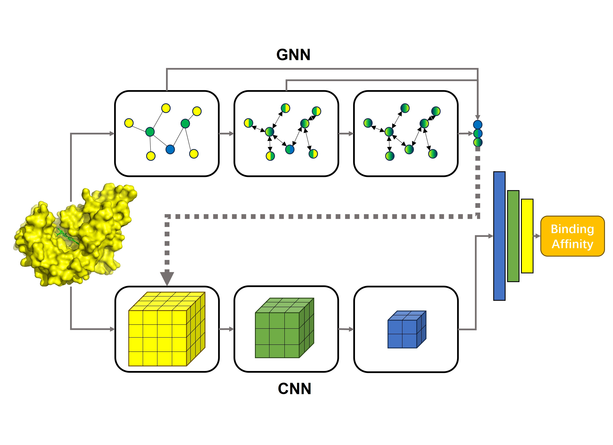

# README

This is the repository for GCNN (https://onlinelibrary.wiley.com/doi/10.1002/jcc.27499)

​​

GCNN is a fusion model sequentially connecting a graph neural network (GNN) and a convolutional neural network (CNN) to predict protein-ligand binding affinity. In this model, the intermediate outputs of the GNN layers, as supplementary descriptors of atomic chemical environments at different levels, are concatenated with the input features of CNN.

# Required Packages

* python==3.6.15
* pytorch==2.1.0
* torch-geometric==2.3.1
* scikit-learn==1.3.1
* tensorflow-gpu==1.2.0
* openbabel==3.1.1
* tfbio-gpu==0.3

# Dataset Preparation

Please organize the datasets according to the following directory structure

* dataset

  * pdbid

    * pdbid\_ligand.mol2

    * pdbid\_protein.mol2

Use Open Babel to protonate ligand molecules and compute their MMFF94 partial charges. Use UCSF Chimera to protonate protein molecules and calculate their partial charges with Amberff14SB force field.

Store binding affinity data of the dataset in a csv file, as shown below:

```csv
pdbid,-logKd,set
2r58,2.0,training
3c2f,2.0,training
3g2y,2.0,training
3pce,2.0,training
4qsu,2.0,training
```

# Training

## Preparing Features of Training and Validation Set

Fill in the sub-items under "create_hdf" in config.yml

```yaml
affinity_data_path: 'path to csv file containing affinity data of training and validation set'
output_node_hdf: 'path to output hdf file containing node features'
output_edge_i_hdf: 'path to output hdf file containing edge indices'
output_edge_a_hdf: 'path to output hdf file containing edge attributes'
training_PDBs_path: 'path to training set'
validation_PDBs_path: 'path to validation set'
path_to_elements_xml: 'path to element_features.xml'
```

Run the following code to generate features of training and validation set: 

```powershell
python prepare/create_hdf.py config.yml
```

## Training GNN

Fill in the sub-items under "training\_GNN" in config.yml

```yaml
cuda: 'indices of GPU to be used'
seed: random seed
epochs: number of epochs
batch_size: batch size
learning_rate: learning rate
heads: number of heads in GATv2 layers
ratio: pooling ratio in SAGPool layer
training_csv: 'path to csv file containing affinity data of training set'
validation_csv: 'path to csv file containing affinity data of validation set'
node_hdf: 'path to hdf file containing node features'
epdge_ind_hdf: 'path to hdf file containing edge indices'
edge_attr_hdf: 'path to hdf file containing edge attributes'
checkpoint_path: 'path to output checkpoint'
best_checkpoint_path: 'path to output best checkpoint'
log_path: 'path to directory to store output results'
```

Run the following code to train GNN module: 

```powershell
python training_GNN.py config.yml
```

## Extracting Intermediate Output of GNN

Fill in the sub-items under "GNN\_int\_output" in config.yml

```yaml
cuda: 'indices of GPU to be used'
heads: number of heads in GATv2 layers
ratio: pooling ratio in SAGPool layer
best_checkpoint_path: 'path to checkpoint file containing model parameters'
dataset_csv: 'path to csv file containing affinity data of training and validation set'
node_hdf: 'path to hdf file containing node features'
edge_ind_hdf: 'path to hdf file containing edge indices'
edge_attr_hdf: 'path to hdf file containing edge attributes'
output_node_hdf: 'path to output hdf file containing new node features of GNN'
```

Run the following code to extract intermediate output of GNN as input grid features of CNN: 

```powershell
python GNN_int_output.py config.yml
```

## Splitting Hdf File of Training and Validation set

Fill in the sub-items under "split\_hdf" in config.yml

```yaml
csv_file: 'path to csv file containing affinity data of training/validation set'
node_file: 'path to hdf file containing new node features of GNN'
path: 'path to directory to store split hdf file training_set.hdf/validation_set.hdf'
dataset_name: 'training'/'validation'
```

Run the following code to split the hdf file of training and validation set:

```powershell
python prepare/split_hdf.py config.yml
```

## Training GCNN0/01

Run the following code to train GCNN0/01: 

```powershell
python training_GCNN0.py/training_GCNN01.py --input_dir path to directory containing training_set.hdf and validation_set.hdf

                                   --cuda indices of GPU to be used

                                   --seed random seed
```

For more options, please run the following code: 

```powershell
python training_GCNN0.py/training_GCNN01.py --help
```

# Predicting

## Preparing Features of Test Set

Fill in the sub-items under "create_test_hdf" in config.yml

```yaml
affinity_data_path: 'path to csv file containing affinity data of test set'
output_node_hdf: 'path to output hdf file containing node features'
output_edge_i_hdf: 'path to output hdf file containing edge indices'
output_edge_a_hdf: 'path to output hdf file containing edge attributes'
test_PDBs_path: 'path to training set'
path_to_elements_xml: 'path to element_features.xml'
```

Run the following code to generate features of test set:

```powershell
python prepare/create_test_hdf.py config.yml
```

## Extracting Intermediate Output of GNN

Fill in the sub-items under "GNN\_int\_output" in config.yml

```yaml
cuda: 'indices of GPU to be used'
heads: number of heads in GATv2 layers
ratio: pooling ratio in SAGPool layer
best_checkpoint_path: 'path to checkpoint file containing model parameters'
dataset_csv: 'path to csv file containing affinity data of test set'
node_hdf: 'path to hdf file containing node features'
edge_ind_hdf: 'path to hdf file containing edge indices'
edge_attr_hdf: 'path to hdf file containing edge attributes'
output_node_hdf: 'path to output hdf file containing new node features of GNN'
```

Run the following code to extract intermediate output of GNN as input grid features of CNN:

```powershell
python GNN_int_output.py config.yml
```

## Predicting Binding Affinity Using GCNN0/01

Run the following code:

```powershell
python test_GCNN0.py/test_GCNN01.py --input path to hdf file containing new node features of GNN

                                    --network path to file containing model parameters (delete “.meta” )

                                    --output path to output results file
```

For more options, please run the following code:

```powershell
python test_GCNN0.py/test_GCNN01.py --help
```

‍
